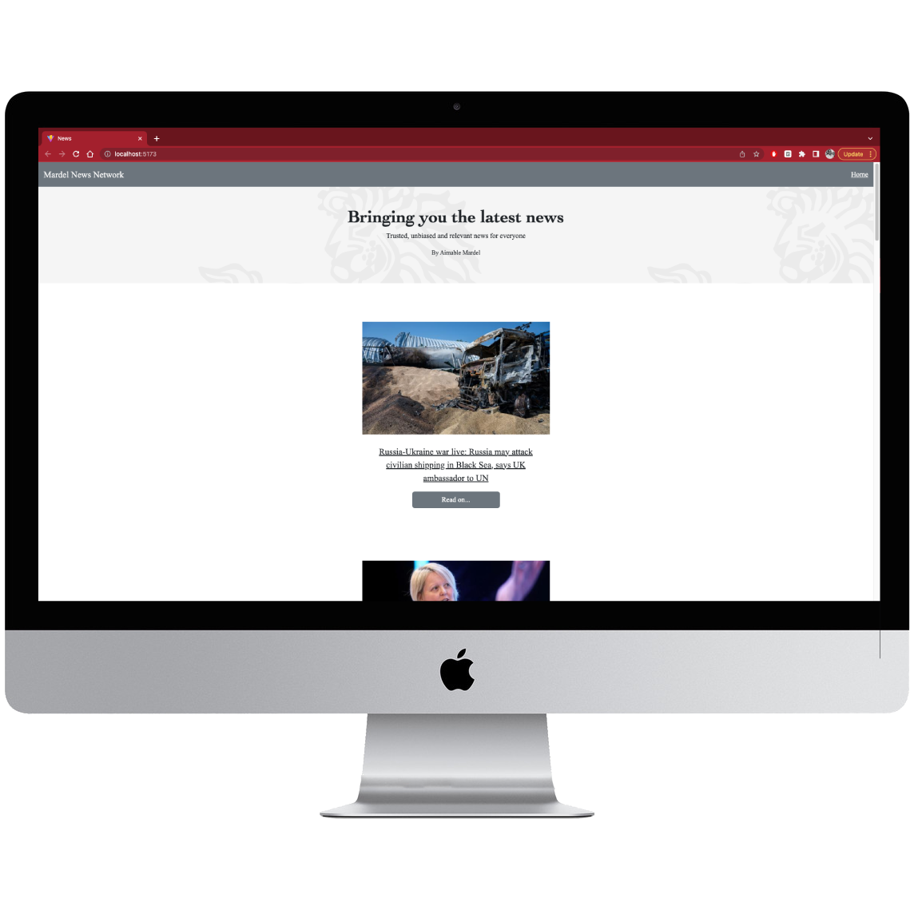
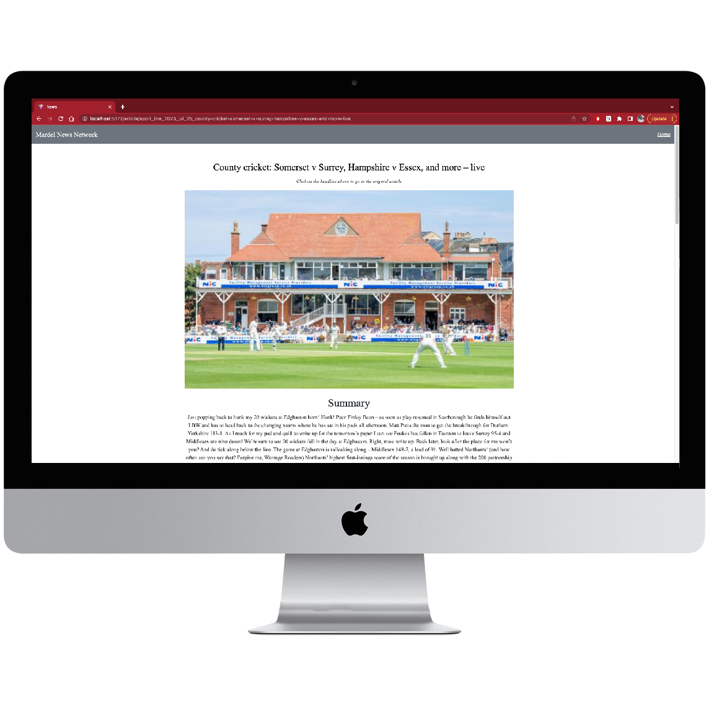
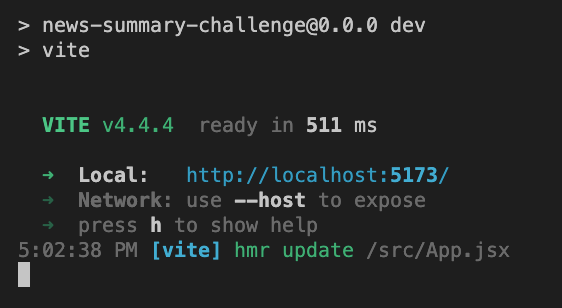
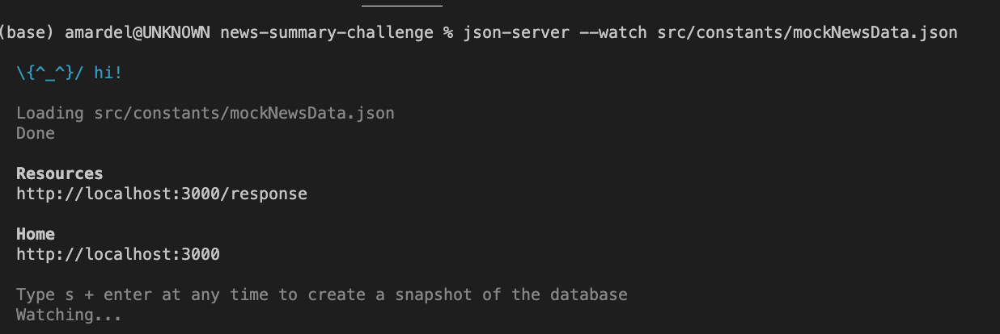
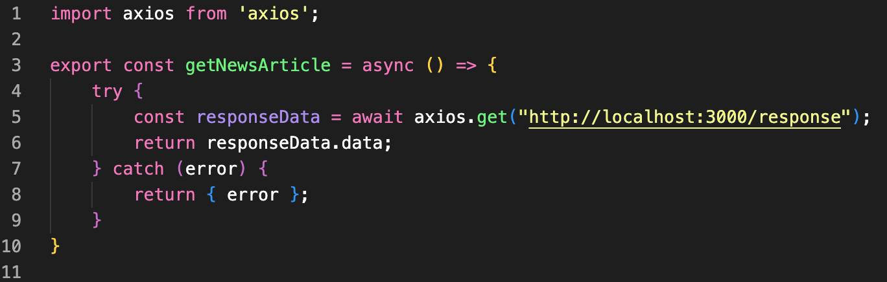

# View Web App Demo Here:

[**https://mardel-news-network.netlify.app/**](https://mardel-news-network.netlify.app/)

# About

---

This challenge tests our knowledge and ability to create a React application that implements routing for navigation, send an API request to display information to the user, and testing the relevant functionalities using vitest testing-library.

The challenge was to show the user a list of the latest articles using the Guardian API. The user should also be able to click on an article and view it in more detail on a summary page.

## The App

---

I implemented 2 routes for this simple app; `/home` and `/article/:id` using React Router Dom. 

For layout and styling, I mainly used Bootstrap along with custom css.

### Home





### Article Summary Page

<br/>


### Phone Display


<br/>

# Installation

In order to view this webpage on your local machine, please follow the following instructions:

- You must first have `node.js` and `npm` installed on your machine. Please follow [these](https://github.com/nvm-sh/nvm#installing-and-updating) instructions if you do not have these installed.
- Next, clone this repository to your local machine.
- Open a new terminal window and navigate to the root directory of this repository: `/news-summary-challenge`.
- run the following command to install all the dependencies listed in the `package.json` file:
    
    ```bash
    npm install
    ```
    
- In the terminal run the following command:
    
    ```bash
    npm run dev
    ```
    

- You will the following in the terminal. Ctrl+click or Cmd+click on the local URL to view the webpage:

<br/>

************************Troubleshooting************************

If there are no articles displaying on your screen, it could be that the API request has been limited. In this case, it would be necessary to create a local json server in order to use the app. Please follow the following instructions in order to do so:

- Firstly, you will need to install json server if you have not already. Type in the following command in a new terminal.
    
    ```bash
    npm i -g json-server
    ```
    

- Next, from the root of the news-summary-challenge repo, run the following command to start the JSON server
    
    ```bash
    json-server --watch /src/constants/mockNewsData.json
    ```
    
- You should see the following in the command line:

<br/>

- Copy the URL under `Resources` into a text editor for use a little later.
- Next, open the file `dataService.js` found in `/src/utils/`
- On line 5 of this file, replace the URL within the `axios.get()` function with the URL you saved a couple of steps above, then save and close the file.

<br/>

- In the terminal where you ran `npm run dev` , type ctrl+c on the keyboard to exit the current dev environment. Then run `npm run dev` again and follow the link. You should now see some older articles rendered.

# Acceptance Criteria User Stories

---

```
As a busy politician
So I know what the big stories of the day are
I can see all of today's headlines in one place
```

```
As a busy politician
So that I have something nice to look at
I can see a relevant picture to illustrate each news article when I browse headlines
```

# Extended Criteria User Stories

```
As a busy politician
So that I can get an in depth understanding of a very important story
I can click a news headline to see a summary and a photo of the news article
```

```
As a busy politician
So I can get a few more details about an important story
I can see click a news article summary title which links to the original article
```

```
As a busy politician
Just in case my laptop breaks
I can read the site comfortably on my phone
```

---

# Tests Completed

1. Test that getNewsArticle makes the external data call.
2. Test that a successful request returns the correct data.
3. Test that an unsuccessful request returns the error.
4. Test that the correct article is chosen when a viewing an article summary page.